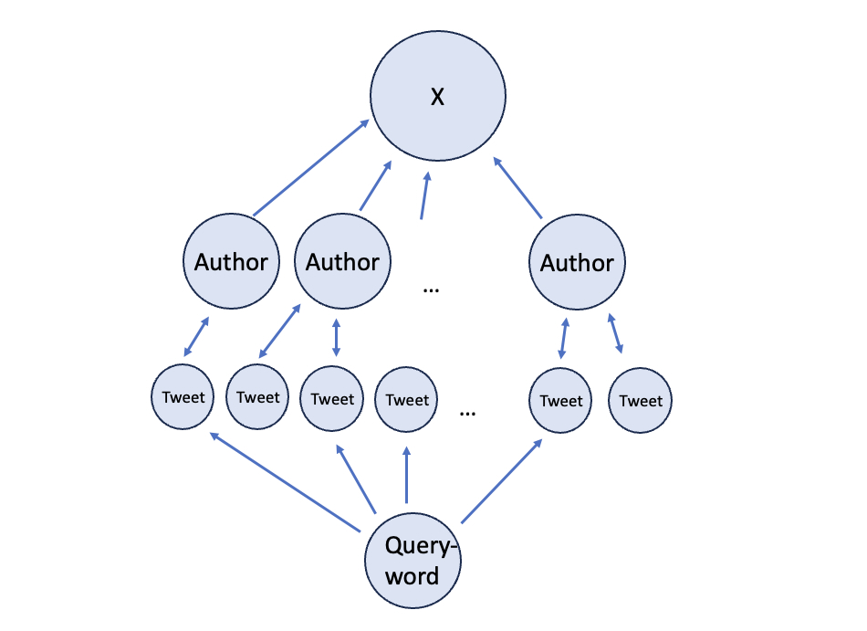
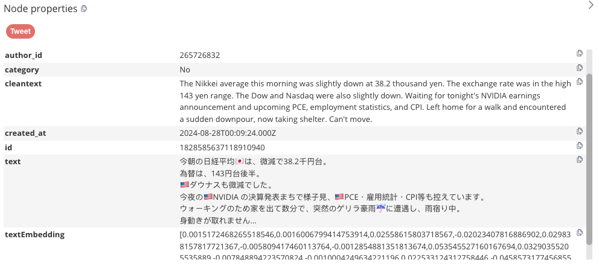
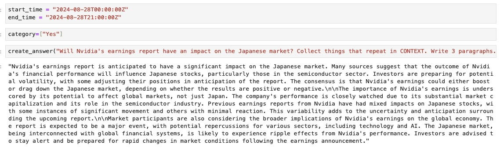

# Talk with X(Twitter) data

This repository shows how to chat with X(Twitter) data.  The process is as follows:

1) We use Neo4j graphRAG to store tweets.
2) We clean each tweet using the LLM model. Cleaning means that the text is translated into English, all links and special characters are removed and the result is summarized.
3) If the tweet contains predictions (the LLM model decides), we set the category value "Yes" or "No" to the tweet.
4) The completion of the LLM model is a json file containing the cleaned tweet and the category value.
5) Tweets are timestamped so they can be queried between time intervals.

We apply the procedure to Nvidia's financial data as of Nvidia's earnings date of August 28, 2024.

GraphRAG contains tweets, authors and query words. An illustrative picture is shown below.



## Setting up the Neo4j Desktop

We use the Neo4j Desktop. It is easy to install and monitor the database content. 

1. Download the software
2. When the installation is complete, create a Project
3. Inside a project, create a Graph DBMS
4. Open Terminal (in Desktop) and copy file 
```console
cp labs/apoc-5.22.0-core.jar plugins/
```
5. Edit the file conf/neo4j.conf and change the line
```console
dbms.security.procedures.unrestricted=jwt.security.*
```
to 
```console
dbms.security.procedures.unrestricted=jwt.security.*, apoc.*
```
6. Restart the database

The database should now be running and be empty.

## Create a Python environment

We setup up the virtual environment where we run the Python scripts

```console
python -m venv venv
source venv/bin/activate
pip install -r requirements.txt
```
## Scripts and data

Jupyter Notebook tweets.ipynb contains the code

1) graph database initialization
2) searching for tweets from user X
3) populating graph database
4) cleaning the tweets and creating embeddings
5) examples how to query and make predictions

An example Tweet node in a graph database looks like this:



## Example prediction

Here is an example query just before the earning call:


